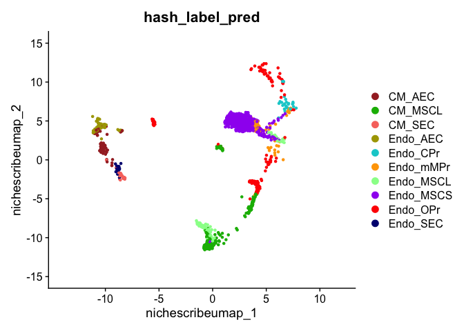
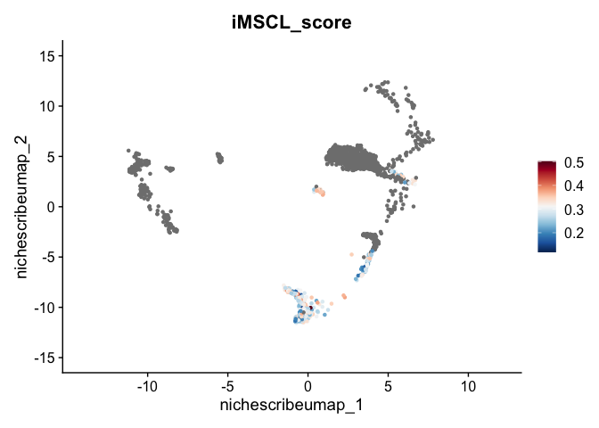

<!-- README.md is generated from README.Rmd. Please edit that file -->

# NicheScribe

<!-- badges: start -->

<!-- badges: end -->

**NicheScribe** is a hierarchical classifier for murine bone marrow
stromal cells based on 10x single cell RNA-sequencing (scRNA-seq) data.
This approach permits rapid, consistent, accurate, and generalizable
annotation of stromal cell types by leveraging curated reference atlases
and gene expression signatures, and facilitates comparative analysis of
the same cell type across conditions. For more information and
applications of NicheScribe, see our accompanying manuscript…

NicheScribe: - extracts \`\`nonhematopoietic’’ cells based on an
extensive reference atlas spanning whole bone marrow, hematopoietic stem
and progenitor cells (HSPCs), and stromal compartments (central marrow
and endosteum), - classifies stromal cells using either 1. a reference
derived from 10 FACS-purified stromal populations, or 2. a manually
curated reference based on key marker genes, - projects stromal cells
onto a reference UMAP embedding for easy visualization, and - scores
inflammation state in leptin receptor-positive mesenchymal stromal cells
(MSC-L) using the top 100 differentially upregulated genes.

## Installation

You can install the current version of **NicheScribe** from GitHub with:

``` r
# install.packages("devtools")
devtools::install_github("RabadanLab/NicheScribe")
```

After installation, you will be prompted to download the reference data
from the [latest
release](https://github.com/RabadanLab/NicheScribe/releases) when you
load the package. This is **required** for the package to function
properly.

## Example

We demonstrate NicheScribe using a stromal-enriched bone marrow dataset
from [Baccin et al. (2020)](https://doi.org/10.1038/s41556-019-0439-6).
The input to NicheScribe is a [Seurat v5](https://satijalab.org/seurat/)
object with a `counts` matrix in the `RNA` assay.

``` r
library(NicheScribe)
suppressPackageStartupMessages(library(Seurat))

# Load Baccin et al. dataset from GEO.
url <- "https://ftp.ncbi.nlm.nih.gov/geo/series/GSE122nnn/GSE122465/suppl/GSE122465_FilteredCounts10x.csv.gz"

counts <- data.table::fread(url)
mat <- as.matrix(counts[, -1])
rownames(mat) <- counts[[1]]

seu <- CreateSeuratObject(mat)

# Run NicheScribe
seu <- NicheScribe(seu)
#> Normalizing query.
#> Finding transfer anchors.
#> Classifying nonhematopoietic cells.
#> Finding new transfer anchors.
#> Classifying stromal cell types.
#> Computing iMSC-L scores.
#> Running UMAP

# Inspect predictions
table(seu$nonhematopoietic_pred)
#> 
#>    hematopoietic nonhematopoietic 
#>             5506             1991
table(seu$hash_label_pred)
#> 
#>    CM_AEC   CM_MSCL    CM_SEC  Endo_AEC  Endo_CPr Endo_mMPr Endo_MSCL Endo_MSCS 
#>        79       467        24        82        25        94       159       828 
#>  Endo_OPr  Endo_SEC 
#>       217        16
table(seu$manual_annot_pred)
#> 
#>             AEC         CM_MSCL    CM_Type_H_EC   CM_Type_L_SEC            CPr1 
#>              87             368              47              34              43 
#>            CPr2         Doublet       Endo_MSCL  Endo_Type_H_EC Endo_Type_L_SEC 
#>              41              42             129              21               8 
#>            MSCS            OPr1            OPr2            OPr3        Pericyte 
#>             843              78              33             192              21 
#>       Type_R_EC 
#>               4

# Visualize results
NichePlot(seu)
```



``` r
InflammationPlot(seu)
```



## Citation

If you use **NicheScribe**, please cite:
