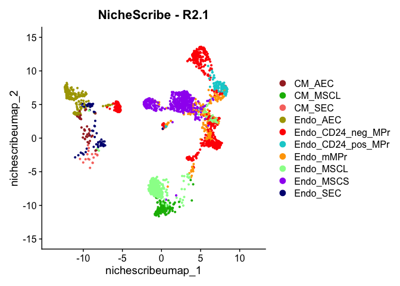
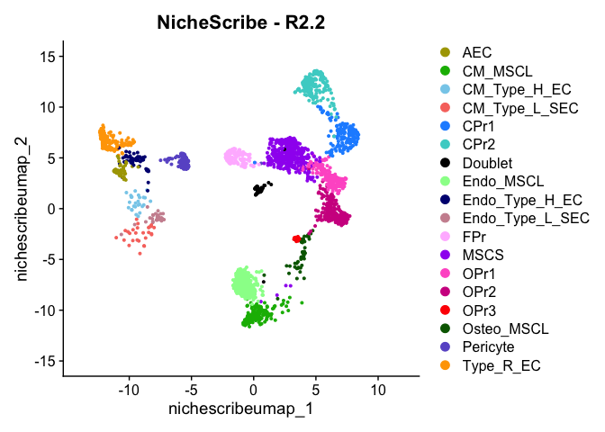
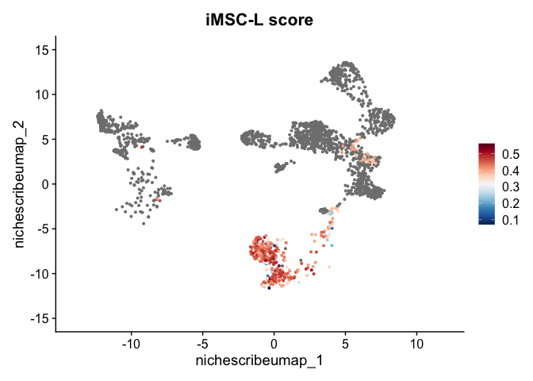

<!-- README.md is generated from README.Rmd. Please edit that file -->

# NicheScribe

<!-- badges: start -->

<!-- badges: end -->

**NicheScribe** is a hierarchical classifier for murine bone marrow
stromal cells based on 10x single cell RNA-sequencing (scRNA-seq) data.
Our approach permits rapid, consistent, accurate, and generalizable
annotation of stromal cell types by leveraging curated reference atlases
and gene expression signatures, and facilitates comparative analysis of
the same cell type across conditions.
<!-- For more information and applications of NicheScribe, see our accompanying manuscript... -->

NicheScribe:

- extracts “nonhematopoietic” cells based on an extensive reference
  atlas spanning whole bone marrow, hematopoietic stem and progenitor
  cells (HSPCs), and stromal compartments (central marrow and
  endosteum),
- classifies stromal cells using either
  1.  a reference derived from 10 FACS-purified stromal populations, or
  2.  a manually curated reference based on key marker genes,
- projects stromal cells onto a reference UMAP embedding for easy
  visualization, and
- scores inflammation state in leptin receptor-positive mesenchymal
  stromal cells (MSC-L) from differentially upregulated genes.

## Installation

You can install the current version of **NicheScribe** from GitHub with:

``` r
# install.packages("devtools")
devtools::install_github("RabadanLab/NicheScribe")
```

After installation, you will be prompted to download the reference data
from the [latest
release](https://github.com/RabadanLab/NicheScribe/releases) when you
load the package. This is **required** for the package to function
properly. Run the following command:

``` r
download_reference()
```

## Example

We demonstrate NicheScribe using a stromal-enriched bone marrow dataset
from [Swann et al. (2026)](https://doi.org/10.1182/blood.2025029513).
The input to NicheScribe is a [Seurat v5](https://satijalab.org/seurat/)
object with a `counts` matrix in the `RNA` assay.

Note that you may run into out-of-memory errors when working with
moderately large scRNA-seq datasets, especially in the UMAP projection
step. We suggest increasing the memory limit beforehand:

``` r
options(future.globals.maxSize = 100000 * 1024^2)
```

``` r
library(NicheScribe)
suppressPackageStartupMessages(library(Seurat))

# Load Swann et al. (2026) dataset from GEO.
options(timeout = 1000)
set3.endo <- ReadMtx(
  cells = "https://www.ncbi.nlm.nih.gov/geo/download/?acc=GSM8505738&format=file&file=GSM8505738%5F3EM%5Fbarcodes%2Etsv%2Egz",
  features = "https://www.ncbi.nlm.nih.gov/geo/download/?acc=GSM8505738&format=file&file=GSM8505738%5F3EM%5Ffeatures%2Etsv%2Egz",
  mtx = "https://www.ncbi.nlm.nih.gov/geo/download/?acc=GSM8505738&format=file&file=GSM8505738%5F3EM%5Fmatrix%2Emtx%2Egz"
)

seu <- CreateSeuratObject(set3.endo, project="Swann2026_endo")

# Normally, the usual data preprocessing and quality control steps are run here but we omit them for brevity.

# Run NicheScribe
seu <- NicheScribe(seu)
#> Normalizing query.
#> Finding transfer anchors.
#> Classifying nonhematopoietic cells.
#> Finding new transfer anchors.
#> Classifying stromal cell types.
#> Computing iMSC-L scores.
#> Running UMAP

# Inspect predictions
table(seu$nonhematopoietic_pred)
#> 
#>    hematopoietic nonhematopoietic 
#>             3348             2569
table(seu$hash_label_pred)
#> 
#>            CM_AEC           CM_MSCL            CM_SEC          Endo_AEC 
#>                41               155                20               223 
#> Endo_CD24_neg_MPr Endo_CD24_pos_MPr         Endo_mMPr         Endo_MSCL 
#>               688               103               192               526 
#>         Endo_MSCS          Endo_SEC 
#>               550                71
table(seu$manual_annot_pred)
#> 
#> Adipo_MSCL        aEC       CPr1       CPr2    Doublet        FPr       hEC1 
#>        431         56        153        191         59        144         26 
#>       hEC2      lsEC1      lsEC2       MSCL       MSCS       OPr1       OPr2 
#>         52         27         31        170        403        197        263 
#>       OPr3 Osteo_MSCL   Pericyte        rEC 
#>         14         46        152        154

# Visualize results
NichePlot(seu, layer="R2.1")
```



``` r
NichePlot(seu, layer="R2.2")
```



``` r
InflammationPlot(seu)
```



<!-- 
## Citation
&#10;If you use **NicheScribe**, please cite:
-->
